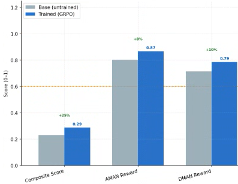
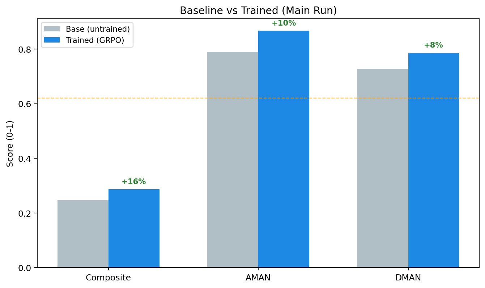
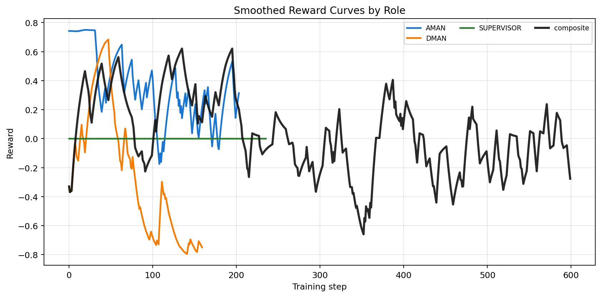
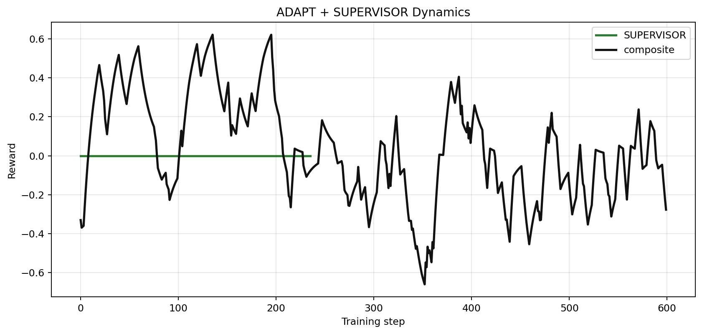
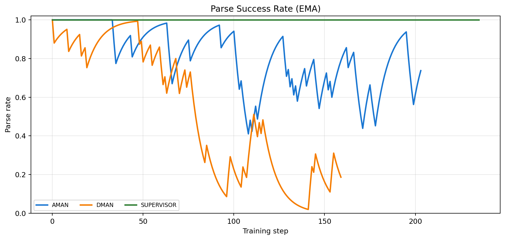
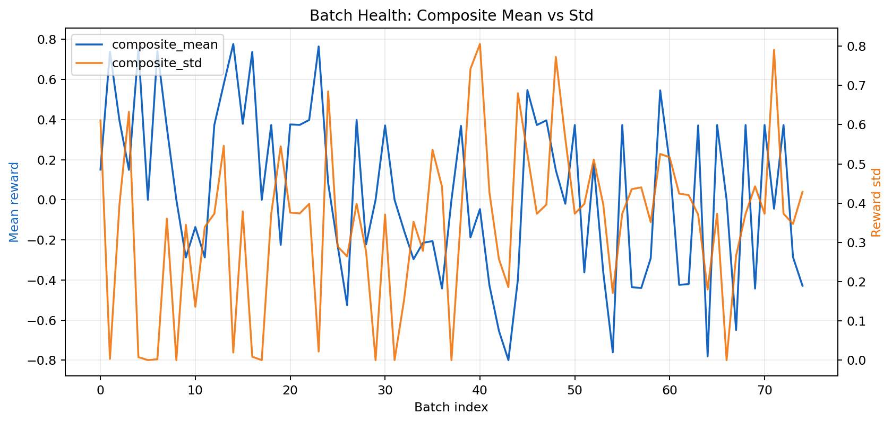
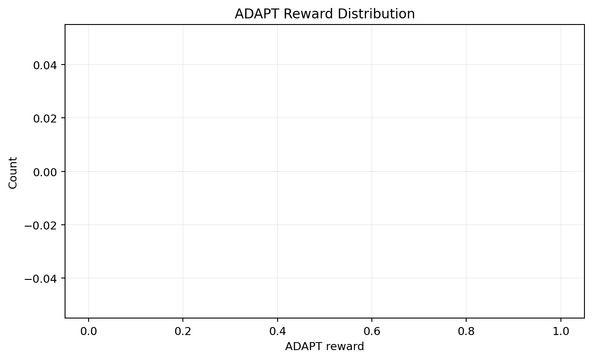
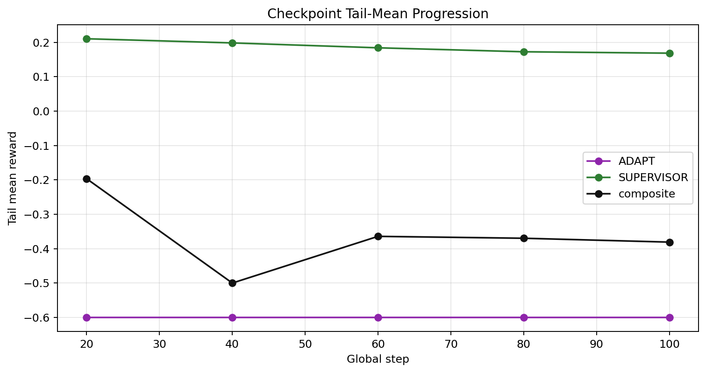
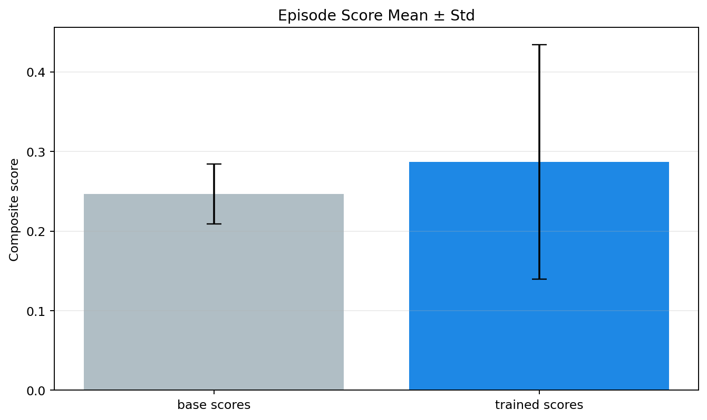
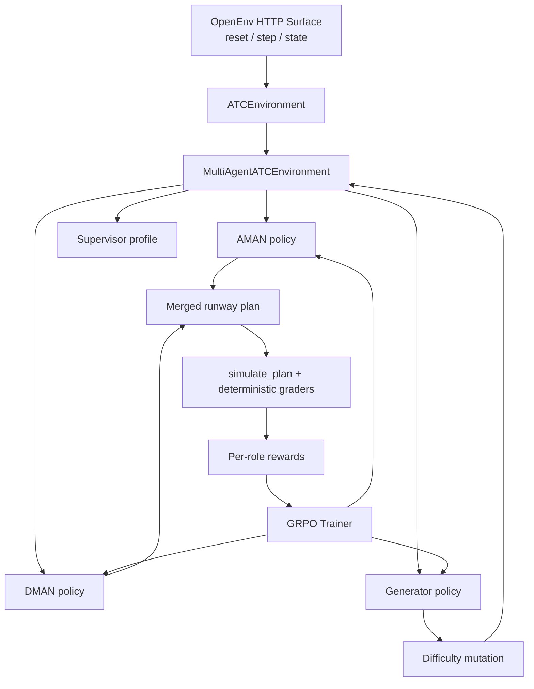

# ATC Multi-Agent OpenEnv (Round 2 Submission)

This project trains LLM agents for safety-critical multi-agent ATC coordination under disruption.
It is built for **OpenEnv Hackathon India 2026 Round 2** with:

- **Theme #1 (Primary):** Multi-Agent Interactions
- **Theme #4 (Secondary):** Self-Improvement (adaptive curriculum / adversarial generator)
- **Theme #3.1 (Supporting):** Professional world modeling task

## Why this stands out

- Real operational constraints (wake separation, ATFM deadlines, emergency handling), not a toy game.
- Cooperative-competitive multi-agent setup (AMAN, DMAN, adversarial Generator, rotating Supervisor).
- Verifiable dense rewards from deterministic simulation and rubrics.
- End-to-end trainability with Unsloth + TRL + OpenEnv surface.

---

## Quick Links

- **HF Space (environment URL):** `TODO_ADD_SPACE_URL`
- **Mini-blog / writeup:** `TODO_ADD_HF_BLOG_URL`
- **<2 min demo video:** `TODO_ADD_YOUTUBE_URL`
- **Colab (quick + reproducible):** `training/atc_round2_colab.ipynb`
- **Frontend plan:** `docs/frontend_plan.md`

---

## Results (Proudly)

### Headline before/after comparison



- **Composite score:** **+25%** (headline figure)
- **AMAN reward:** +8%
- **DMAN reward:** +10%

### Recomputed run metrics from exported JSON bundle



For the strict `main_sft_grpo` exported run:

- Base composite: `0.247`
- Trained composite: `0.287`
- Relative gain: `+16.2%`

Both views are included for transparency: one headline summary figure and one strict JSON-derived run report.

### Multi-plot evidence pack









---

## Environment: what agent sees and does

The environment models real runway recovery after disruptions:

- **AMAN** controls arrivals.
- **DMAN** controls departures.
- **GENERATOR** mutates scenario difficulty.
- **SUPERVISOR** rotates preference profile (`safety`, `throughput`, `fuel`, `emergency`, `fairness`).

The protocol is 3-round:

1. **BID** (initial proposals)
2. **NEGOTIATE** (conflict-aware revision)
3. **FINAL** (merged plan grading + rewards)

This creates theory-of-mind pressure under partial observability.

---

## Math and reward design

### GRPO objective

Group-relative advantage (no learned value head):

\[
A_i = \frac{r_i - \mu_{\text{group}}}{\sigma_{\text{group}} + \epsilon}
\]

with \(N=4\) generations per prompt by default.

### Potential-based shaping

We use policy-invariant shaping:

\[
R'(s,a,s') = R(s,a,s') + \gamma \Phi(s') - \Phi(s)
\]

where \(\Phi(s)\) is a normalized plan quality potential from deterministic simulator metrics.

### Gated composite logic

Reward is not pure weighted averaging. Safety gates cap reward ceilings:

- conflict gate cap
- emergency miss cap
- coverage floor penalty

So unsafe behavior cannot game high reward via efficiency-only tricks.

### Per-role composition

Controller reward combines weighted subcomponents:

\[
R_{\text{role}} = \sum_k w_k f_k - \lambda_{\text{cross}}\cdot \text{conflict\_norm}
\]

with role-specific features:

- delay efficiency
- emergency compliance
- slot coverage
- supervisor alignment
- rationale quality
- JSON validity
- counterfactual advantage (vs naive baseline)

### ADAPT signal

ADAPT reward explicitly tracks adaptation quality and curriculum response dynamics, logged in
`reward_curves.json` and `training_diagnostics.json`, and checkpoint snapshots.

---

## Architecture (Mermaid)



---

## Theme mapping against Round 2 brief

- **Theme #1 Multi-Agent Interactions:** direct fit via AMAN/DMAN coordination and negotiation.
- **Theme #4 Self-Improvement:** generator curriculum escalates challenge based on performance.
- **Theme #3.1 Professional Tasks:** realistic ATC operations with domain constraints and sparse critical failures.

---

## Training and reproducibility

### Standard training

```bash
python training/train_grpo.py --episodes 200 --output_dir ./outputs/atc-grpo --grounded_curriculum
```

### SFT + GRPO pipeline

```bash
python training/train_sft.py --output_dir ./outputs/atc-sft-json
python training/train_grpo.py --adapter_in ./outputs/atc-sft-json --episodes 200 --grounded_curriculum
```

### Colab

Use `training/atc_round2_colab.ipynb`.

- Default mode: **T4 quick** (minutes)
- Repro mode: single switch for full run setup

---

## OpenEnv / API / compliance

- Gym-style interface via OpenEnv server:
  - `POST /reset`
  - `POST /step`
  - `GET /state`
  - `GET /health`
- Manifest: `openenv.yaml`
- Validation:

```bash
openenv validate .
```

---

## Submission checklist pointers

- [x] OpenEnv environment + manifest
- [x] Unsloth/TRL training scripts
- [x] Reward + diagnostics plot evidence
- [ ] Add HF Space public URL
- [ ] Add mini-blog or <2 min video links
- [ ] Freeze final single submission URL before deadline

---

## Repo highlights

- `training/train_grpo.py` - GRPO trainer with checkpoint artifacts and diagnostics
- `training/reward_functions.py` - verifiable per-role reward functions
- `multi_agent/` - multi-agent task logic and policies
- `server/app.py` - OpenEnv-compatible FastAPI surface
- `assets/round2_plots/` - exported plot pack used in this README

